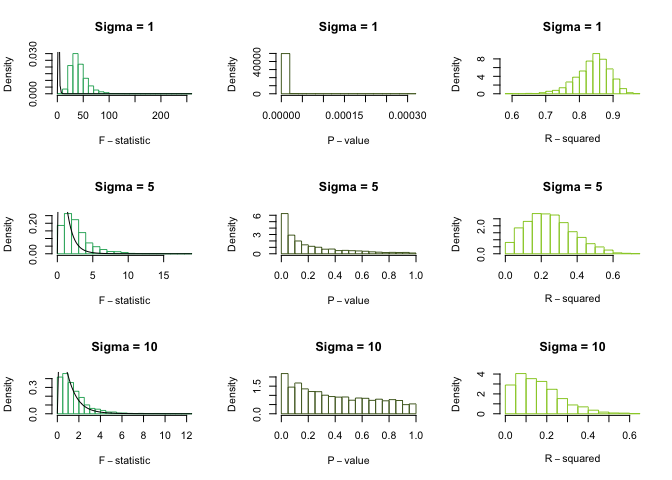
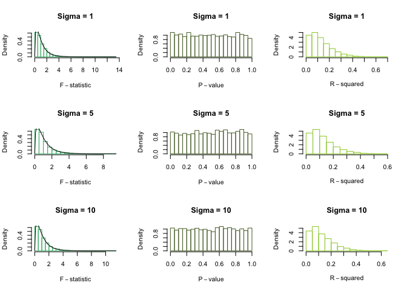
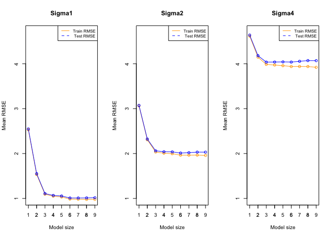
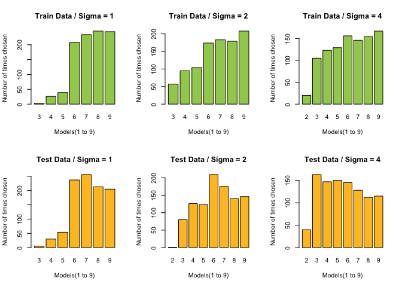
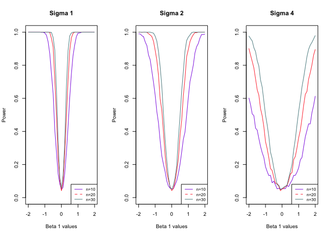

Simulation project
================
Apoorva Srinivasa, apoorva6
6/15/2018

Simulation Study 1, Significance of Regression
----------------------------------------------

### Introduction

In this simulation study we will investigate the significance of regression test. We will simulate from two different models:

**The “significant” model**

where *ϵ*<sub>*i*</sub> ∼ *N*(0, *σ*<sup>2</sup>) and

-   *β*<sub>0</sub> = 3,
-   *β*<sub>1</sub> = 1,
-   *β*<sub>2</sub> = 1,
-   *β*<sub>3</sub> = 1.

**The “non-significant” model**

where *ϵ*<sub>*i*</sub> ∼ *N*(0, *σ*<sup>2</sup>) and

-   *β*<sub>0</sub> = 3,
-   *β*<sub>1</sub> = 0,
-   *β*<sub>2</sub> = 0,
-   *β*<sub>3</sub> = 0.

For both, we will consider a sample size of 25 and three possible levels of noise, σ.

-   n=25
-   σ∈(1,5,10)

We will use study\_1.csv throughout Study 1 to get predictor values.

### Methods

``` r
study_1 <- read.csv("study_1.csv")

birthday = 19920720
set.seed(birthday)

#Initialisations
beta_0 <-  3
num_sims <- 2500
n <- 25

par(mfrow = c(3, 3))

simulation <- function(beta_1,beta_2,beta_3,sigma)
{
  fstat  <- as.vector(rep(0, num_sims))
  p_value <- as.vector(rep(0, num_sims))
  r_squared <-  as.vector(rep(0, num_sims))
  for(i in 1:num_sims) 
  {
    eps   <-  rnorm(n, mean = 0 , sd = sigma)
    study_1$y  <-  beta_0  + beta_1 * study_1$x1 + beta_2 * study_1$x2 +beta_3 * study_1$x3 + eps
    fit  <-  lm(y ~ x1+x2+x3, data = study_1)
    fstat[i] = summary(fit)$fstatistic[1]
    # Extracting Degrees of freedon
    df1 <- summary(fit)$fstatistic[2]
    df2 <- summary(fit)$fstatistic[3]
    p_value[i] <- pf(as.vector(summary(fit)$fstatistic[1]), df1 =df1 , df2=df2 , lower.tail=FALSE)
    r_squared[i] <-  summary(fit)$r.squared
  }
    

    hist(fstat, prob = TRUE, breaks = 20,
         xlab = expression(F-statistic), main = paste0('Sigma = ',sigma), border = "mediumseagreen")
    curve(df(x, df1 = df1, df2 = df2),add=T)
    hist(p_value, prob = TRUE, breaks = 20,
         xlab = expression(P-value),  main = paste0('Sigma = ',sigma), border = "darkolivegreen")
    hist(r_squared, prob = TRUE, breaks = 20,
         xlab = expression(R-squared), main = paste0('Sigma = ',sigma), border = "yellowgreen")
    return(list(fstat=mean(fstat), p_value=mean(p_value),r_squared= mean(r_squared)))
  
}
```

### Results

Calling the "simulation" function for each of the regression models

``` r
par(mfrow = c(3, 3))
###### Significant Model Simulation #########
sigma <- c(1,5,10)
sapply(sigma, simulation, beta_1 = 1, beta_2=1, beta_3=1)
```



    ##           [,1]         [,2]      [,3]     
    ## fstat     41.46744     2.660027  1.524769 
    ## p_value   5.412969e-07 0.2137281 0.3975326
    ## r_squared 0.8405175    0.2490885 0.1619551

``` r
###### Non-Significant Model Simulation ######
sapply(sigma, simulation, beta_1 = 0, beta_2=0, beta_3=0)
```



    ##           [,1]      [,2]      [,3]     
    ## fstat     1.133541  1.087761  1.110134 
    ## p_value   0.4934741 0.5083406 0.499926 
    ## r_squared 0.1274543 0.1229224 0.1252915

### Discussion

-   Under the null hypothesis, we know that the true value of f statistic follows an F distribution.
-   Also, R squared follows a normal distribution.
-   For empirical distributions, we plot the above graphs to study whether they match the true distributions.
    -   For Significant model:
        -   F statistics does not follow an F-distribution. It seems like it follows a highly skewed chi-square distribution
        -   P- value is a highly right-skewed F-distribution
        -   R squared follows a normal distribution but is slightly skewed
    -   For non-significant model:
        -   F statistics follows an F-distribution and matches the true distribution.
        -   P value follows a uniform distribution
        -   R-squared is highly right-skewed when compared to the former model. It is also seen to get more skewed as the value of sigma increases. To sum it up, the empirical distributions vary quite a lot between the significant and non-significant models.
-   Both of the R-squared and sigma measures give a numeric assessment of how well a model fits the sample data. As R-squared increases and Sigma decreases, the data points move closer to the fit line, which is an ideal case. In the significant model, the R squared is quite spread out and is also closer to the value of 1, which is good. But for the non-significant model, the R-squared values are distributed towards the lower end and thus but increasing sigma, R squared distribution shifts even more to the left.

Simulation Study 2, Using RMSE for Selection?
---------------------------------------------

### Introduction

For this exercise we will simulate the below model:

where *ϵ*<sub>*i*</sub> ∼ *N*(0, *σ*<sup>2</sup>) and

-   *β*<sub>0</sub> = 0
-   *β*<sub>1</sub> = 5
-   *β*<sub>2</sub> = −4
-   *β*<sub>3</sub> = 1.6
-   *β*<sub>4</sub> = −1.1
-   *β*<sub>5</sub> = 0.7
-   *β*<sub>6</sub> = 0.3

We will consider a sample size of 500 and three possible levels of noise. That is, three values of σ.

-   n=500
-   σ∈(1,2,4)

We will use study\_2.csv throughout to get predictor values.

### Methods

``` r
study_2 <- read.csv("study_2.csv")

birthday = 19920720
set.seed(birthday)

#Initialisation
n <- 500
beta_0 <- 0
beta_1 <- 5
beta_2 <- -4
beta_3 <- 1.6
beta_4 <- -1.1
beta_5 <- 0.7
beta_6 <- 0.3
beta_7 <- 0
beta_8<- 0
beta_9 <- 0
num_sims <- 1000
sigma <-  c(1,2,4)

#Defining a function to build test and train models for all 9 cases

RMSE_model_train <- list()
RMSE_model_test <- list()
model <- function(sigma, parm)
{
  RMSE_model_train <- rep(0, num_sims)
  RMSE_model_test <- rep(0, num_sims)
  for(i in 1:num_sims)
  { 
    
    #Creating train and test samples 
    trn_idx = sample(1:nrow(study_2), 250)
    ####Training Dataset#####
    train <- study_2[trn_idx, ]
    ####Test Dataset#####
    test <- study_2[-trn_idx, ]
    n_trn <- nrow(train)
    n_tst <- nrow(test)
    
    # Fit train model
    eps   <-  rnorm(250, mean = 0 , sd = sigma)
    train$y  <-  beta_0  +  beta_1 * train$x1 + beta_2 * train$x2 + beta_3 * train$x3 + beta_4 *train$x4 + beta_5 * train$x5 + beta_6 * train$x6  + eps
    fit  <-  lm(paste0('y~',parm), data = train)
    RMSE_model_train[i] <- sqrt((1/n_trn) * sum((train$y - fit$fitted.values) ^ 2))
    
    # Train model
    test_fit <- predict(fit, newdata = test)
    test$y  <-  beta_0  +  beta_1 * test$x1 + beta_2 * test$x2 + 
      beta_3 * test$x3 + beta_4 * test$x4 + beta_5 * test$x5 + 
      beta_6 * test$x6  + eps
    RMSE_model_test[i] <- sqrt((1/n_tst) * sum((test$y - test_fit) ^ 2))
    
  }

  return(list(mRMSE_model_train=mean(RMSE_model_train),mRMSE_model_test=mean(RMSE_model_test),
             RMSE_model_train=RMSE_model_train,RMSE_model_test=RMSE_model_test))

}


t_RMSE_model_train_1<-cbind()
t_RMSE_model_test_1<-cbind()
t_RMSE_model_train_2<-cbind()
t_RMSE_model_test_2<-cbind()
t_RMSE_model_train_4<-cbind()
t_RMSE_model_test_4<-cbind()
model_size <- 1:9
train_list = list()
test_list = list()

for(i in 1:9)
{
  c_parm<-paste0('x',1:i,'+',collapse = '')
  c_parm<-substr(x = c_parm,start = 1,stop = nchar(c_parm)-1)
  res<-sapply(sigma, model,parm = c_parm)
  res<-as.data.frame(res)
  names(res)<-sigma
 
   #Extracting all 1000 values of test and train for future plotting purposes 
   t_RMSE_model_train_1<-cbind(t_RMSE_model_train_1,unlist(res[[1]][3]))
   t_RMSE_model_train_2<-cbind(t_RMSE_model_train_2,unlist(res[[2]][3]))
   t_RMSE_model_train_4<-cbind(t_RMSE_model_train_4,unlist(res[[3]][3]))
   t_RMSE_model_test_1<-cbind(t_RMSE_model_test_1,unlist(res[[1]][4]))
   t_RMSE_model_test_2<-cbind(t_RMSE_model_test_2,unlist(res[[2]][4]))
   t_RMSE_model_test_4<-cbind(t_RMSE_model_test_4,unlist(res[[3]][4]))
  
   #Extracting mean RMSE values for test and train for future plotting purposes
   train_list[[i]] <- as.data.frame(cbind(res[[1]][1],res[[2]][1],res[[3]][1]))
   test_list[[i]] <- as.data.frame(cbind(res[[1]][2],res[[2]][2],res[[3]][2]))
}

train_data <- do.call(rbind, train_list)
test_data <- do.call(rbind, test_list)
```

### Results

-   For each value of sig, we create a plot that shows how average Train RMSE and average Test RMSE change as a function of model size.

``` r
par(mfrow = c(1,3))
for (i in 1:3)
{
  plot(model_size,train_data[,i], xlab = "Model size", ylab = "Mean RMSE" ,col= "orange", main = paste0('Sigma',sigma[i]),ylim=c(1,4.7))
  lines(model_size,train_data[,i], col= "orange")
  lines(model_size,test_data[,i], type ="o", col= "blue")
  axis(side = 1, at = model_size)
  legend("topright", legend=c("Train RMSE", " Test RMSE"),
         col=c("orange", "blue"), lty=1:2, cex=0.8)
}
```



-   Below, we show the number of times the model of each size was chosen for each value of sigma

``` r
par(mfrow = c(2,3))

res_train_1<-table(apply(t_RMSE_model_train_1,1,which.min))
res_train_2<-table(apply(t_RMSE_model_train_2,1,which.min))
res_train_4<-table(apply(t_RMSE_model_train_4,1,which.min))

res_test_1<-table(apply(t_RMSE_model_test_1,1,which.min))
res_test_2<-table(apply(t_RMSE_model_test_2,1,which.min))
res_test_4<-table(apply(t_RMSE_model_test_4,1,which.min))


barplot(res_train_1,main= "Train Data / Sigma = 1", col="darkolivegreen3", xlab= "Models(1 to 9)",ylab="Number of times chosen")
barplot(res_train_2,main= "Train Data / Sigma = 2", col="darkolivegreen3", xlab= "Models(1 to 9)",ylab="Number of times chosen")
barplot(res_train_4,main= "Train Data / Sigma = 4", col="darkolivegreen3", xlab= "Models(1 to 9)",ylab="Number of times chosen")
barplot(res_test_1,main= "Test Data / Sigma = 1", col="goldenrod1", xlab= "Models(1 to 9)",ylab="Number of times chosen")
barplot(res_test_2, main= "Test Data / Sigma = 2", col="goldenrod1", xlab= "Models(1 to 9)",ylab="Number of times chosen")
barplot(res_test_4, main= "Test Data / Sigma = 4", col="goldenrod1", xlab= "Models(1 to 9)",ylab="Number of times chosen")
```



### Discussion

-   Before diving into this particular scenario, it is good to recall that in the real world, R squared and RMSE values always decrese as the number of predictors increase.
-   In this case, since we have bifurcated our dataset as train and test, we can expect the train dataset to have lower RMSE values than the test; as the model is built on this dataset. In case of test this could either be true or not.

-   From plot 1, we can see that as the value of sigma increases there is more deviation between the test and train RMSE values. Also, as compared to sigma=1, sigma=2 and 4 have higher values of RMSE on an average. Further, we can see that sigma=4 has almost double the average RMSE as compared to sigma=1. Thus it is always best to have lower values of Standard error.

-   Out of the 1000 simulations that we have, train shows that model 9 is the winner because of more number of lowest RMSE values across the simulations. However, in the ideal case, test 6 should be the best. This trend is shown by the test simulations. This crealy shows that the training model is **overfit**. Hence it is more suitable to consider the test dataset to study the relationships between predictors and response variables.

-   Further, on increasing the number of simulations to 5000, the RMSE values of test and train still show a similar trend as that with 1000 simulations. Thus, I believe that 1000 simulations are good enough to conduct this experiment.

    -   In our simulation, the best model for test is model 6 for sigma=1 and 2, but as sigma increases, there is lot of stray noise that disturbing the output from considering model 6 to be the best model.

Thus, to sum it up, we answer the following questions : - 1) Does the method always select the correct model? On average, does it select the correct model? Out of the 1000 simulations, we can deduce that the above experiment **does not** choose model 6 as the best model for every simulations that it executes. However, on an average: - The test overfits the model, assuming predictors x7 to x9 are related to the response. Thus it declares model 9 as the best model. - On the contrary, test data set provides more accurate results, that the model 6 is the best as it is not biased. - 2) How does the level of noise affect the results? As the level of noise increases the test results move farther away from the train results.

Simulation Study 3, Power
-------------------------

### Introduction

In this simulation study we will investigate the power of the significance of regression test for simple linear regression.

H0: *β*1 = 0 vs H1: *β*1 ≠ 0

The significance level, α, is defined as the probability of a Type I error.

α = P\[Reject H0 ∣ H0 True\] = P\[Type I Error\]

Similarly, the probability of a Type II error is often denoted using β; however, this is not the same as regression parameter.

β = P\[Fail to Reject H0 ∣ H1 True\] = P\[Type II Error\]

Power is the probability of rejecting the null hypothesis when the null is not true, that is, the alternative is true and β1 is non-zero.

Power= 1−β = P\[Reject H0 ∣ H1 True\]

Essentially, power is the probability that a signal of a particular strength will be detected. Many things affect the power of a test. In this case, some of those are:

-   Sample Size, n
-   Signal Strength, β1
-   Noise Level, σ
-   Significance Level, α We’ll investigate the first three.

To do so we will simulate from the model

where *ϵ*<sub>*i*</sub> ∼ *N*(0, *σ*<sup>2</sup>) and

For simplicity, we will let *β*<sub>0</sub>=0, thus *β*<sub>1</sub> is essentially controlling the amount of “signal.” We will then consider different signals, noises, and sample sizes:

β1 ∈ (−2,−1.9,−1.8,…,−0.1,0,0.1,0.2,0.3,…1.9,2) σ ∈ (1,2,4) n ∈ (10,20,30) We will hold the significance level constant at α=0.05.

### Methods

``` r
birthday = 19920720
set.seed(birthday)

#Initialisation
n <- c(10,20,30)
beta_0 <- 0 
sigma <- c(1,2,4)
beta_1 <- seq(from = -2,to = 2, by = 0.1)
alp <- 0.05


sim_slr = function(n,sigma, beta_1) 
{
  num_sims = 1000
  cnt<- 0
 for(i in 1:num_sims)
 {
  x_values = seq(0, 5, length = n)
  epsilon = rnorm(n, mean = 0, sd = sigma)
  y = beta_0 + beta_1 * x_values + epsilon
  model <- lm(y ~ x_values)
  
  #Finding P value
  f_stat <- summary(model)$fstatistic
  df1 <- summary(model)$fstatistic[2]
  df2 <- summary(model)$fstatistic[3]
  S_reg <- pf(as.vector(summary(model)$fstatistic[1]), df1 =df1 , df2=df2 , lower.tail=FALSE)
  if(S_reg < alp) {cnt <- cnt +1} else cnt 
  
 }
  Power <- cnt/num_sims
}
```

### Results

-   We create three plots, one for each value of σ. Within each of these plots, add a we “power curve” for each value of n that shows how power is affected by signal strength, β1.

``` r
colors <- c("blueviolet","firebrick1","cadetblue4")
par(mfrow = c(1,3))

for (i in c(1,2,4))
{
    plot(1, type="n",main =paste("Sigma",i), xlab="Beta 1 values", ylab="Power", xlim=c(-2,2), ylim=c(0,1), new=TRUE)
  legend("bottomright", legend=c("n=10", "n=20","n=30"),
         col=c("blueviolet", "firebrick1","cadetblue4"), lty=1:2, cex=0.8)
    cnt = 1
    for(j in c(10,20,30))
      {
      Y = rep(0,length(beta_1))
      for (k in 1:length(beta_1))
         {
           y = sim_slr(n = j, sigma =i, beta_1= beta_1[k])
           Y[k] <- y
         }
         lines(beta_1,Y, col = colors[cnt])
         cnt = cnt + 1
      }
}
```



### Discussion

-   Power is the ability to reject the null hypothesis when the alternate hypothesis is true. In this case, for all beta\_1 values not equal to 0 we should be rejecting the Null hypothesis. Let's observe whether this happens in most cases:
    -   On plotting power against the range of beta 1 values for each size of observation, we observe a uniform distribution about beta 1=0. In ideal case scenario, the power value at beta\_1=0 should be 0 or undefined. But in our case, since we have defined a significance level of 0.05, we can see that there is exactly an error of this proportion, irrespective of the number of observations and sigma values. Further, on observing the estimated bet\_1\_hat values for predictors x7 to x9, they are close to 0 but not perfect 0.
    -   The curves we get by plotting for sigma=1 have flattened tails and less variance. As the variance increases, so does the variance in the plot and we see that for sigma= 4 the maximum attainable value of power goes very low for low observation values. Also, for lower number of observations, the curve is not at all smooth.
-   By increasing the number of simulations(to say 5000), we can see that the variance in the curve reduces. Even at sigma=4 and nobs= 10 the curve is pretty stable, i.e there are values close to power=1.
